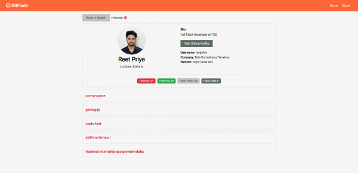

GitFindrr is a web application built using React that allows users to search for and display detailed GitHub profile information. It integrates the GitHub API to fetch and present data in an intuitive and user-friendly interface.

### Features:

1. **GitHub Profile Details**: Displays information such as name, bio, location, company, followers, following, and public repositories.
2. **Repository List**: Fetches and lists the user's public repositories with clickable links.
3. **Live API Integration**: Uses the GitHub API to retrieve real-time data.

### Technologies Used:

- **React.js**: For building the user interface.
- **GitHub API**: For fetching user data dynamically.
- **CSS/SCSS**: For styling and responsive design.

### How to Run:

1. Clone the project repository from the relevant source (e.g., GitHub).
2. Open a terminal and navigate to the project directory.
3. Install the required dependencies by running `npm install`.
4. Start the development server using `npm start`.
5. Open a browser and go to `http://localhost:3000` to view the app.

### Usage:

- Search for a GitHub username in the app.
- View user details like bio, followers, public repositories, and other stats.
- Click on repository links to explore individual projects.
